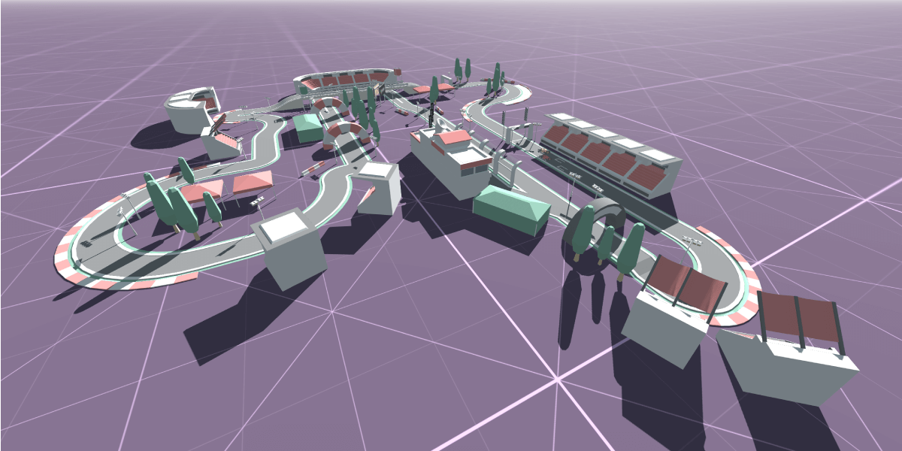

  <h1>🏁 Racing Circuit</h1>
  

 

  🌐 <a href="https://racing-circuit.pages.dev" target="_blank">Website</a>
  &nbsp;·&nbsp;
  🔑 <a href="https://github.com/iivvaannxx/racing-circuit?tab=MIT-1-ov-file#readme">License</a>
  &nbsp;·&nbsp;
  📦 <a href="https://kenney.nl/assets/racing-kit">Asset Kit</a>

  

  
<em><b>A racing circuit app I made to teach a friend how to use Three.js.</b></em>

  

    
    
    
    
  
  

## 🎮 Controls

Upon entering the scene, most likely you will be presented with a loading screen. It automatically fades away when everything has been loaded. After that you can move around using the following controls: 

- **Orbit Camera (Moving)**: Using the left mouse button (desktop) or 1 finger touch (mobile) and dragging.
- **Truck Camera (Panning)**: Using the right mouse button (desktop) or 2/3 fingers touch (mobile) and dragging.
- **Dolly Camera ("Zooming")**: Using the mouse wheel, either scrolling or pressing it and dragging the mouse (desktop). 2 fingers pinch-in or out (mobile).

## ✨ Features

The UI panel on the top right is made with [lil-gui](https://github.com/georgealways/lil-gui). You can use it to interact with the scene. These are:

### Sky

 - **Animate Cycle**: This simulates a day cycle, note that it's not a day-night cycle, that would have been a bit complex for a simple "tutorial" app like this. It moves the sun on the sky dome affecting the shadows on the scene. This is a bit demanding, so if you have a low-end device, you might want to disable it.

 - **Sun Elevation**: This is a slider that controls the elevation of the sun. If the `Animate Cycle` is enabled, this will be overridden by the animation, and you won't be able to change it.

 - **Sun Rotation**: This is a slider that controls the rotation of the sun. If the `Animate Cycle` is enabled, this will be overridden by the animation, and you won't be able to change it.

### Cars

There is an option for each car (there are 2), but they are the same. Each car has a predefined path that it follows. Both cars are initially positioned at the starting line.

- **Move**: A checkbox that enables the movement of the car along its path.
- **Color**: A color picker that changes the color of the car.
- **Position**: A normalized slider that changes the position of the car along its path. 0 is the starting position, and 1 is the ending position, because the path is a loop, both values represent the same. 

### Scene

- **Debug**: A checkbox that enables the debug mode. This mode shows some helpers and information about the scene, like the world axes, the car paths and the sun position.

- **Camera**: A dropdown that changes the camera mode. There are 3 modes: `Free`, `Car 1`, and `Car 2`. The `Free` mode is the default one, and it allows you to move around the scene freely. The `Car 1` and `Car 2` modes are attached to the cars, so they move with them.

- **Race**: A button that starts a race between the cars. The cars will start moving from the starting line to the ending line, each with a random speed.

> [!NOTE]
> Because of how the paths are defined (not even close to being realistic), the one that goes through the inside of the circuit is a bit shorter than the one that goes through the outside. This means that the car that goes through the inside will have a slight advantage.

## Credits

A lot of thanks to [Kenney](https://kenney.nl) for the [Racing Kit](https://kenney.nl/assets/racing-kit) that I used to make this project. It's a great asset pack with a lot of cool stuff. The circuit is based on the one that can be found in the screenshots of the asset pack, but with some modifications.